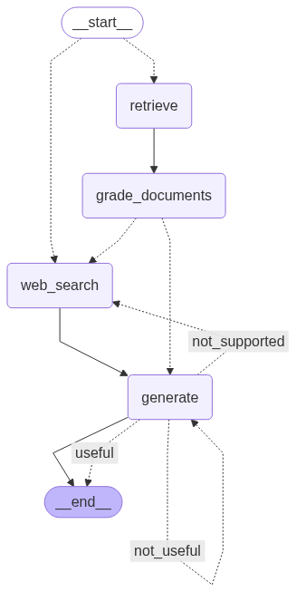
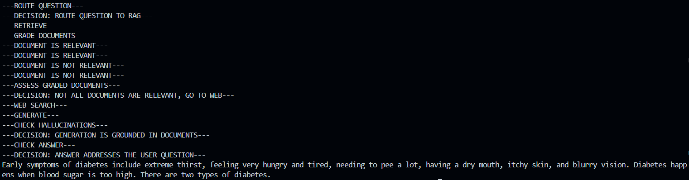

# 🩺 MediSense AI

**An Agentic AI-Powered Medical Assistant** — built to retrieve, validate, and generate reliable medical answers using advanced RAG techniques.

---

## 🧠 Overview

MediSense AI is an intelligent medical question-answering system I developed to explore **agentic AI workflows** in the healthcare domain. It combines document retrieval, self-evaluation, and web search fallback to deliver accurate, grounded medical responses.

The system is built on top of **LangGraph** and implements a multi-stage pipeline inspired by recent advances in Retrieval-Augmented Generation:

| Technique | Purpose |
|---|---|
| **Corrective RAG (CRAG)** | Self-grades retrieved documents; falls back to web search when relevance is low |
| **Self-RAG** | Evaluates generated answers to minimize hallucination |
| **Adaptive RAG** | Routes queries dynamically based on complexity |

---

## 🏗️ Architecture

The agentic workflow follows a graph-based execution model:



**Pipeline Flow:**
1. **Query Analysis** — Classifies the incoming question and decides the retrieval strategy
2. **Document Retrieval** — Fetches relevant chunks from the Pinecone vector store
3. **Relevance Grading** — Each retrieved document is scored for relevance; irrelevant docs are filtered out
4. **Web Search Fallback** — If no relevant documents are found, Tavily web search is triggered
5. **Answer Generation** — Generates a response grounded in the retrieved context using Google Gemini
6. **Hallucination Check** — Self-grades the answer against source documents to ensure factual accuracy

---

## ⚙️ Tech Stack

| Layer | Technology |
|---|---|
| **AI Framework** | LangGraph, LangChain |
| **LLM** | Google Gemini 2.0 Flash |
| **Vector Store** | Pinecone |
| **Web Search** | Tavily API |
| **Backend** | FastAPI |
| **Frontend** | Streamlit |
| **Language** | Python 3.10+ |

---

## 🚀 Getting Started

### Prerequisites

- Python 3.10+
- API keys for: Google AI, Pinecone, Tavily, LangChain

### Setup

```bash
# Clone the repo
git clone https://github.com/anand2026/Midsense-AI.git
cd Midsense-AI

# Create and activate a virtual environment
python -m venv venv
source venv/bin/activate  # On Windows: venv\Scripts\activate

# Install dependencies
pip install -r requirements.txt
```

### Environment Variables

Create a `.env` file in the project root:

```env
GOOGLE_API_KEY=your_google_api_key
PINECONE_API_KEY=your_pinecone_api_key
TAVILY_API_KEY=your_tavily_api_key
LANGCHAIN_API_KEY=your_langchain_api_key
```

---

## 💻 Usage

### Option 1 — CLI Mode

Run the pipeline directly from the terminal:

```bash
python agent_runner.py
```

You can modify the question inside `agent_runner.py`:

```python
question = "What are the symptoms of diabetes?"
```



### Option 2 — Web Interface (Recommended)

**Start the FastAPI backend:**

```bash
uvicorn app:app --reload
```

The API docs will be available at [http://127.0.0.1:8000/docs](http://127.0.0.1:8000/docs)

**Start the Streamlit frontend:**

```bash
streamlit run main.py
```

Open [http://localhost:8501](http://localhost:8501) to interact with MediSense AI through the web UI.

> **Note:** Make sure `main.py` is pointing to the correct backend URL (`http://127.0.0.1:8000/process/` for local, or your deployed URL for production).

---

## 📁 Project Structure

```
MediSense-AI/
├── main.py              # Streamlit frontend
├── app.py               # FastAPI backend
├── agent_runner.py      # CLI runner for the agentic pipeline
├── requirements.txt     # Python dependencies
├── graph/
│   ├── graph.py         # LangGraph workflow definition
│   ├── state.py         # Graph state schema
│   ├── consts.py        # Constants
│   ├── ingestion.py     # Document ingestion into Pinecone
│   ├── nodes/           # Individual graph nodes (retrieve, grade, generate, etc.)
│   └── chains/          # LLM chain definitions
└── data/                # Source medical documents
```

---

## 📋 Key Features

- **Agentic Workflow** — Multi-step reasoning with decision nodes, not a simple prompt-response loop
- **Self-Correction** — Automatically detects and corrects low-quality retrievals and hallucinated answers
- **Web Search Fallback** — Seamlessly falls back to live web search when local documents are insufficient
- **Full Transparency** — Tracks and displays the complete agent execution flow for every query
- **Modular Design** — Each pipeline stage is an independent, testable node

---

## 🔮 Future Improvements

- [ ] Add support for multi-turn conversations with memory
- [ ] Integrate more medical knowledge bases (PubMed, MedlinePlus)
- [ ] Add user authentication and query history
- [ ] Deploy as a containerized microservice with Docker

---

## 📄 License

This project is for educational and research purposes.
